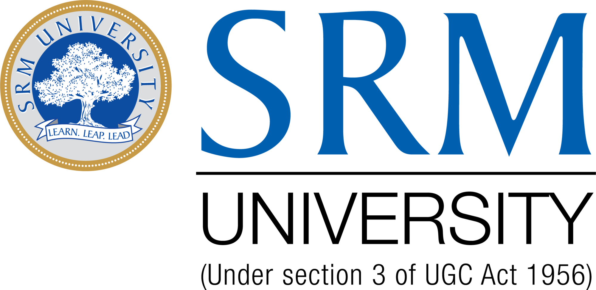

# SRM Waste Collection Optimizer

A full-stack web application for optimizing waste collection routes and maximizing value for SRM University’s Kattankulathur campus. The system uses advanced algorithms to select and route waste pickups based on truck capacity, waste type, and value.

---

## Features

- **Hybrid Knapsack Algorithm:** Selects the most valuable combination of divisible and indivisible waste within a truck’s capacity.
- **Route Optimization:** Calculates the most efficient collection route using a value-weighted Traveling Salesman Problem (TSP) approach.
- **Interactive Dashboard:** Visualizes routes and results on a campus map with Google Maps and Leaflet.
- **Modern UI:** Responsive, user-friendly interface with real-time feedback.

---

## Project Structure

```
backend/
    app.py
    requirements.txt
    algorithms/
        knapsack.py
        routing.py
    data/
        distances.json
        waste_data.json
frontend/
    index.html
    script.js
    style.css
    assets/
        srm-university-seeklogo.png
```

---

## How It Works

1. **User Inputs Truck Capacity:**  
   Enter the truck’s maximum load (kg) in the dashboard.

2. **Backend Optimization:**  
   - The backend ([`app.py`](backend/app.py)) loads campus waste and distance data.
   - [`hybrid_knapsack`](backend/algorithms/knapsack.py) selects the optimal set of waste items.
   - [`optimize_route`](backend/algorithms/routing.py) computes the most efficient pickup order.

3. **Frontend Visualization:**  
   - The optimized route and collection details are displayed on a map and in a results table.
   - Markers and routes are color-coded for clarity.

---

## Getting Started

### Prerequisites

- Python 3.11+
- Node.js (for static server, optional)
- Google Maps API Key (for frontend map)

### Backend Setup

1. **Install dependencies:**
    ```sh
    cd backend
    pip install -r requirements.txt
    ```

2. **Run the Flask server:**
    ```sh
    python app.py
    ```
    The API will be available at `http://127.0.0.1:5000/`.

### Frontend Setup

1. **Open `index.html` directly in your browser**  
  
2. **Ensure the backend is running.**

3. **Set your Google Maps API key**  
   Replace the API key in the script tag in [`index.html`](index.html) if needed.

---

## Example

- Enter a truck capacity (e.g., 300 kg).
- Click **Optimize Collection**.
- View the optimal route and collection summary on the dashboard.

---

## Algorithms

- **[`hybrid_knapsack`](backend/algorithms/knapsack.py):**  
  Combines 0/1 and fractional knapsack to handle both indivisible and divisible waste types.

- **[`optimize_route`](backend/algorithms/routing.py):**  
  Uses NetworkX to solve a value-weighted TSP for the selected blocks.

---

## Data

- **Waste Data:** [`waste_data.json`](backend/data/waste_data.json)
- **Distance Matrix:** [`distances.json`](backend/data/distances.json)

---

## Screenshots



---


## Authors

- [Vikram S] – [vikramsrinivas150@gmail.com]


